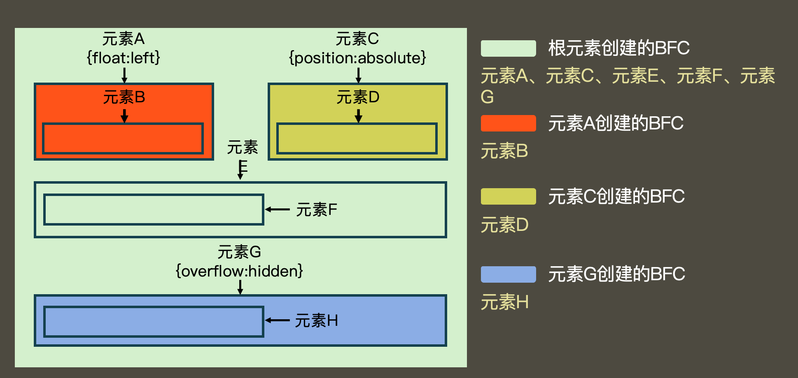
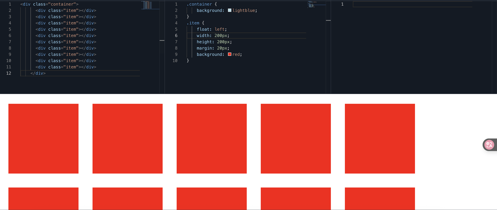
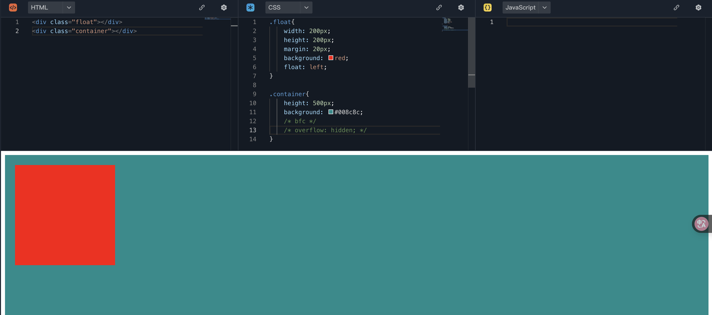
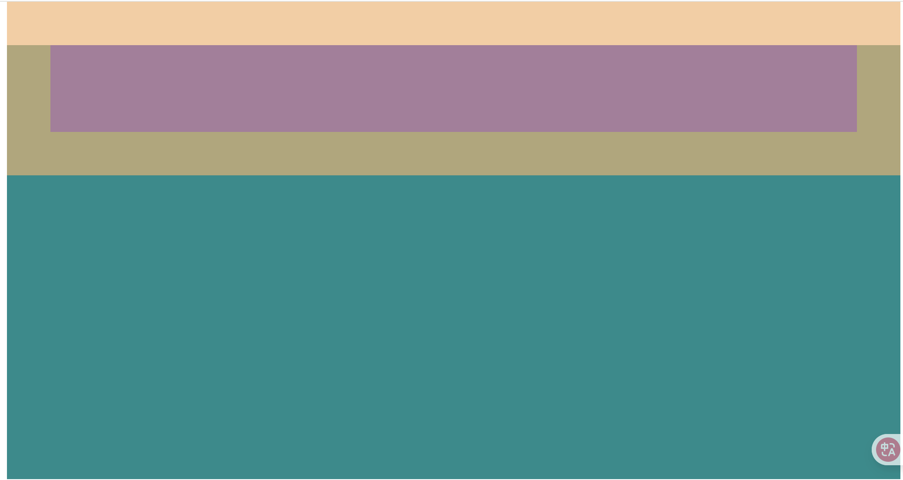
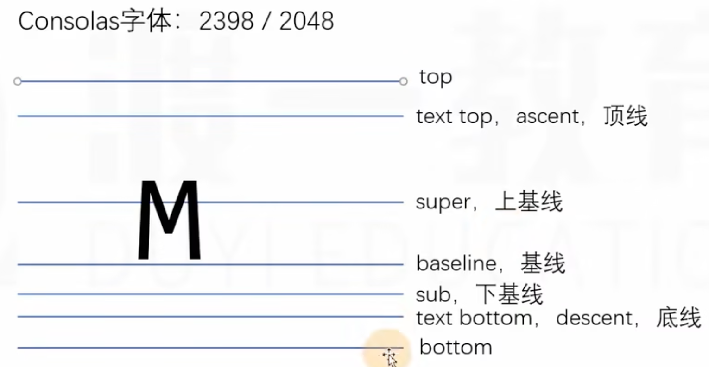

## @规则

at-rule: @规则、@语句、CSS语句

- import，写法 @import “路径” 导入另外一个css文件
- charset “utf-8” 告诉该游览器使用的字符编码集（必须写到第一行）


## web字体和图标

### web字体
解决用户电脑上没有安装相应字体的问题，强制让用户下载该字体

使用@font-face指令制作一个字体

### 字体图标
网站：www.iconfont.cn


## 块级格式化上下文（BFC）
它是一块**独立的渲染区域**，它规定了在该区域中，常规流块盒的布局
- 常规流块盒在水平方向上，必须撑满包含块
- 常规流块盒在包含块的垂直方向上依次摆放
- 常规流块盒若外边距无缝相邻，则进行外边距合并
- 常规流块盒的自动高度和摆放位置，无视浮动元素

BFC渲染区域：这个区域有某个HTML元素创建，以下元素会在其内部创建BFC区域
1. 根元素
2. 浮动和绝对定位元素
3. overflow不等于visible的块盒



不同的BFC区域，它们进行渲染时互不干扰

创建BFC的元素，隔绝了它内部和外部的联系，内部的渲染不会影响到外部
具体规则
- 创建BFC的元素，它的自动高度需要计算浮动元素
在以下图片中container容器的背景颜色未显示出来，是因为高度塌陷了，在以前的写法中可以使用clearfix来消除，
现在则可以使用以下方法
1. 创建绝对定位（position： absolute）（不推荐）
2. 使用浮动：float：left（不推荐）
3. 副作用最小的方式使用 overflow：hidden （最推荐，只要不是visiable就行）
::: info 提示
如果仅仅是解决高度坍塌，还是推荐以前的方法，这里只是介绍一个可用的方法
:::   

- 创建BFC的元素，它的边框盒不会与浮动元素重叠

在以下代码中表明常规流元素在摆放时看不见浮动的元素，如果要设置左边和右边的边距要设置左边的margin-right才有效，设置右边的margin-left无效。**此方法可以用于左边固定，右边自动适应的场景**

- 创建BFC的元素，不会和它的子元素进行外边距合并（处在不同bfc的元素，它们的外边距不会合并）

以下代码中的container容器和child子元素，它们的外边距就合并了
```html
<style>
      .container {
        background: #008c8c;
        height: 500px;
        margin-top: 30px;
        /* overflow: hidden; */
      }
      .child {
        height: 100px;
        margin: 50px;
        background: red;
      }
    </style>
  </head>
  <body>
    <div class="container">
      <div class="child"></div>
    </div>
  </body>
</html>
```



## 布局

### 多栏布局

两栏布局

:::: details 代码
```html
<!DOCTYPE html>
<html lang="en">
  <head>
    <meta charset="UTF-8" />
    <meta name="viewport" content="width=device-width, initial-scale=1.0" />
    <title>Document</title>
    <style>
      .clearfix::after {
        content: "";
        display: block;
        clear: both;
      }
      .container {
        background: lightblue;
        width: 1000px;
        margin: 0 auto;
        /* 新增 */
        overflow: hidden;
      }
      .aside {
        float: left;
        background: #008c8c;
        width: 300px;
        /* 新增 */
        height: 10000px;
        margin-bottom: -9990px;
      }
      .main {
        /* float: right;
        width: 600px; */
        overflow: hidden;
        background: gray;
      }
    </style>
  </head>
  <body>
    <div class="container clearfix">
      <aside class="aside">
        Lorem ipsum dolor sit amet consectetur adipisicing elit. Aut, molestias.
        Temporibus nemo quae error sapiente necessitatibus nulla recusandae
      </aside>
      <div class="main">
        Lorem ipsum dolor sit amet consectetur adipisicing elit. Atque, a quos
      </div>
    </div>
  </body>
</html>
```
::::

三栏布局

### 等高
1. CSS3弹性盒
2. JS控制
3. 伪等高


### 元素书写顺序
1. 先写浮动元素


### 后台页面的布局


## 行高的取值

line-hight

1. 像素值，px
2. 无单位数字
3. em单位
4. 百分比


## body的背景

**画布 canvas** （不是html5中的canvas元素）

一块区域
特点：
1. 最小宽度为视口宽度
2. 最小高度为视口高度

**HTML元素的背景**覆盖画布

**BODY元素的背景**如果HTML元素有背景，body元素正常（背景覆盖边框盒）
如果HTML元素没有背景，BODY元素的背景覆盖画布


**关于画布背景图**
1. 背景图的宽度百分比，相对于视口
2. 背景图的高度百分比，相对于html元素
3. 背景图的位置百分比、预设值，相对于视口
4. 背景图的纵向位置百分比、预设值，相对于网页高度

## 行盒的垂直对齐

### 多个行盒垂直方向的对齐
给没对齐元素设置 vertical-align
- 预设值
- 数值

### 图片的底部白边

图片的父元素是一个块盒，块盒高度自动，图片底部和父元素底边之间往往会出现空白 
1. 设置父元素的字体大小为0，font-size: 0; 副作用：如果父元素中有字就看不见了
2. 将图片设置为块盒（行块盒都不行）


## 参考线-深入理解字体

font-size、line-hight、vertical-aligen、font-family

### 文字
文字是通过一些文字制作软件制作的例如：fontforge
制作文字时，会有几根参考线，不同的文字类型，参考线不一样，同一种文字类型，参考线相同


### font-size
字体大小，设置的是文字的相对大小
文字的相对大小：1000、2048、1024

文字顶线到底线的距离，是文字的实际大小（content-area,内容区）
行盒的背景，覆盖content-area


### 行高
顶线向上延伸的空间和底线向下延伸的空间，两个空间相等，该空间叫gap（空隙）
top到botoom，叫virtual-area(虚拟区), 行高就是虚拟区，可以进行设置


line-height：normal，默认值
文字一定出现在一行到最中间 （错误）
content-area一定出现在virtuak-area的中间 


### vertical-align
一个元素如果子元素出现行盒，该元素内部也会产生参考线

baseline：该元素的基线于父元素的基线对齐
super：该元素的基线与父元素的上基线对齐
sub：该元素的基线与父元素的下基线对齐
text-top：该元素的virtual-area的顶边，对齐父元素的text-top
text-bottom：该元素的virtual-area的底边，对齐父元素的text-bottom
top：该元素的virtual-area的顶边，对齐父元素的top（该行中的最高顶边）
bottom：该元素的virtual-area的底边，对齐父元素的bottom

实际，一个元素的实际占用高度（高度自动），高度的计算通过line-box计算。
行盒组合起来，可以形成多行，每一行的区域叫做line-box，line-box的顶边是该行内所有行盒的最高顶边，底边是该行行盒的最低底边
行盒：inline-box
行框：line-box

数值：相对于基线的偏移量，向上为正数，向下为负数。

百分比：相对于基线的偏移量，百分比是相对于自身virtual-area的高度

line-box是承载文字内容的必要条件，以下情况不生成行框：

1. 某元素内部没有任何行盒
2. 某元素字体大小为0


### 可替换元素和行块盒的基线

图片：基线位置位于图片的下外边距。
表单元素：基线位置在内容底边
行块盒：
1. 行块盒最后一行有line-box，用最后一行的基线作为整个行块盒的基线。
2. 如果行块盒内部没有行盒，则使用下外边距作为基线